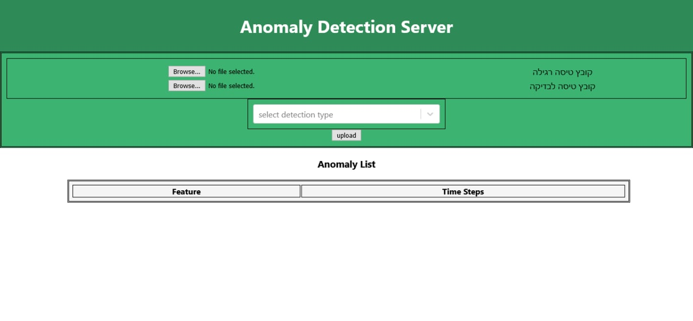

#Anomaly-Detection-WebApp

##Preview from Website

##Description Application
The application allows uploading two files to the server.
The first file will be a valid csv file with no exceptions and the second file may contain exceptions.
The user can select an anomaly detection algorithm from the list displayed to him. When a user uploads the files to the server, an anomaly is detected and the output with the anomaly report will appear in front of the user.
In addition the user will receive a json file that includes a report of where the anomalies occurred.

##Directory hierarchy

  ##Model
  - The model is a folder of database storage, reading and writing from the database.
  - **AnomalyDetectionModel.js** copy and write and read from database 
   

  ##View
  - View displayed to customer (user).
   - **index.html** this file is main of the website is the first page that the user that see.
  ##Controller
  - The application management folder, here the server receives the requests of the taker and returns the answers he requested
    - **expServer.js** this file is the setting of the server
      like url  listener and get and post request and response .

##Installation and Running the application

- For Developers - install a proper IDE for Web Application (we used WebStorm but you can use any other software). You will need to install few programs and modules-
-[ ]  **Node.js** - we worked with 14.17.0 version which you can [download here Node.js]("https://nodejs.org/en/download/")
 -[ ]  **npm** - install npm [download from npm]("https://www.npmjs.com/get-npm")
   -[ ]  open cmd (command line) as administrator and continue:
       - `npm install --global windows-build-tools@4.0.0`
       - `npm config set msvs_version 2017`
   -[ ] - Working Directory - `cd ~/DirApplication/controller`
       - `npm init express`  
       - `npm express -file upload`  
       - `npm install nodemon`
       - `npm install --save http-proxy-middleware`
       - `npm install body-parser`
       - `npm install cors`
    
    -[ ] - install view - `cd ~/DirApplication/view`
       - `npm create-react-app`
       - `npm react-select`
       - `npm install axios --save`
    
##The Website is running!
###open next link on the browser:
 [http://localhost:8080/]("http://localhost:8080/")
        
###you can try now upload two files , one of list exceptions and second of csv and test the app.

##Documentation
Here you can find a Link to UML that contains partial information of the central classes. UML represents the various connections between the classes and the most important information found in each class. UML can be found here. If you are a developer you can find full documentation of functions, variables, and more in the code.
- [linkUml]("https://viewer.diagrams.net/?highlight=0000ff&edit=_blank&layers=1&nav=1&title=umlwebapp.html#R7Vvrc9o4EP9rmMl9CIOfwMdA%2Brib9C7TZNrrp47ACqiVLU4WAfrX38qW%2FJINpuHRTriZS631Wki7P%2B9L644zDtfvOFrMP7AA047dC9Yd57Zj2%2F2BDX8lYZMSXMdPCTNOgpRk5YQH8gMrYk9RlyTAcYlRMEYFWZSJUxZFeCpKNMQ5W5XZnhgt%2F%2BoCzbBBeJgialI%2Fk0DMFdXq9fIb7zGZzdVPDzx1Y4Km32ecLSP1exGLcHonRHoaxRrPUcBWBZLzpuOMOWMivQrXY0ylVLXE0ufeNtzNlsxxJNo88KflXL97%2FufDjHxcs%2FX7G9uO3117am1io0WBA5CMGjIu5mzGIkTf5NRRsl0sZ%2B3BKOe5Y2wBRAuI37AQG6VmtBQMSHMRUnUXr4n4Vz7e7Xtq%2BEXNJq9v18XBRg8iwTfFp%2BT4i55RDvLnkpF%2B8IlFQi3FkeN0x3KbjYJUpJgt%2BRRriA99y%2FKGTz0fDwd4cG31FU4Rn2GxRcRWpmt4ezALMSwOnuOYIkGey4tACsezjC9XKFwondbrt3GFz4gutXLXiwfMnzE31B6vSEhRhMuaSmSnmOQYUTKL4HoKooJJnBFMJQi8RzfqhpAQGE3nhAZ3aMOWUjCxgJdEj0ZzxskPmBbp34DbXCvI9kscD%2FJJpUaOY%2BC511qyMtIdioXimTJK0SImk2zBIWiHRCMmBAsVk97pW0LpmFHGEwE4T8l%2FBryztzadPyRTdU3RBNNR9vrrmRIDIDfF2ffMliSiLPycYpLSfYtCQiVUP2EeoAiVAWvZjeCUksfrAsmEmLrrKgOkbHNmdFcFS%2Bcr2rxg5Cxt5A6LyqGBSgOMlFSB2EqeGp0UP4kabIYkCBIDFi%2FQlESzx8RcXVs55S558NbJKR%2BVOJwEGAIJlGIrQ8A9i4kgTM7PU97RgpFIJCLzRh3vNqFwMWYRbAKRRI0YMLvCErcjU8HNL%2FJulWsd%2B%2B1UPDiCgrW%2FKyl4JPfIYnG1kG7RHnP8Xxde3z8M1cMGRZ3qq6%2FO3tpPLVNZ0a6paElazYnAD0CXa1pBwCPdHMz3RBNLMAcc4agGEGXFj0AO417XkxCwxzC28vF5UOG47VCh0XNYWJjeKIUFeM8rsVngFBXJX4kLn0o5TMBT%2BbNcIheknAQpfksXcQik1AZNfgNYKIkFjq6kQC62YysiDGW3AkkjIgYtPcrRENFkPpYxvooh3QA9jFiwgT3GmF%2BwcUpsWDpMPRs4LAMcIADBKeQDNbnOy7HQmP9kMWadrsuZRTUvLeZabis9bQ%2F77XLYb7mmTbd7NUrqHyDqr1WSbSjpE8GrV6od1%2F%2FV1OMY6lFlvlepH6eiH%2Ffs%2BmmRNxeKOMWqSnMV7KAQtntDU0RWnRvoHUtGVl3u6aNQ4ieaxPIfAiBadxP0XmKEn48RmiHaHCYMzh0lmCaOY5DEZzz5RASi8QURp0XE8IQFiXpEuAYiPuKYLqn4K2ZR9xsgoncN%2FwMRaGMWLnCExaU4cW7gWHaNN651NUdDjlmhiCmeijsSiwQ3F4icGSLuuSsWOisuQCQNPr5dHM2JweCfPfQwKxTVwPRmscgdzphjJHDucC5wOSVc3LPXswa7kz0cBTey9QVGE8rkOXma9FWJwCePujuF0%2FbCuHrYX0gRdZuGbtlIejS6umOjvksjXeWLmyu0e9%2FdXNGQotZprnXHhZruXgK1UE9zKulu3ytPke5IPZUDwJjI9Qbdvl2Zy%2B36fuU0Nt28MR%2FoF20KbOp9aly306tfd9PynIZ9NvIP9uN3t68HLtId5m9PptcX1B7NwsBNxEJEN7dYQNhGWFRf7SqUVIolpqQb5EVdLjW2ec%2FGl5T0Aa1LjPu2wxS7TfS4pimllandqyDt1fShZFgqWlnPPpKVtU2nHCRoSKFBcHyVjhl%2FTA%2BogTliHO6BBcV%2Fo1DRUAolTWw8fTq9k%2F5tHHKhJbJlQ0stVo7mkWvbF07hkXc0iBUdda8Lq2zdTwmDe8wJiEfW4l%2FgvffS5zEcc9muOMNKdbmtX7ZspzyRX5mowSEfzEeZQZ9lYOzXOX1pAcwDOA2vEo1kLdkFILl1huBop5jmOYxpCV6bloYVJdW49pMqyTHDPefVK8mtvEqu7Z1ZS3VFkd8hy82%2FRegUPkRQT235FOHn%2FGtjK%2BXu7Ng5nRO2Kl5Y28m9s%2BN%2BZSLX7toDr2%2B56m8rn7x3klxdvtvfukrH3ZN%2FuB%2B%2Fu309x0mSHbNgHfOp8Uq%2BipT4RNFNRc3u0DTJ9eda7tGMsnlIrtLbr4EulXxdCgITQa7lKElkl6WqCmiylun9ZsJJ0Io1hCSz4Q6JxoRPQZG1tx9IuKC41W8ISIJiSIVw47nMJXHfYTT2SdzrAa2P4g8P6DZpVSHMYItE2MXvFaMg%2Fx6rEn8EBIUsCh7nJKqYNMutBCJJPLDz68odEJooQ7WfkdodcjSaKN1bqx3RQaKFag3Ycyp1m7bRglctKjpet1KWP1CEUO1200tu9OBVfnc7v1cVyb785fXsGyHAMP8UOWXPv%2FR23vwP")

##Video
Here you can find a link to our demo video - link.